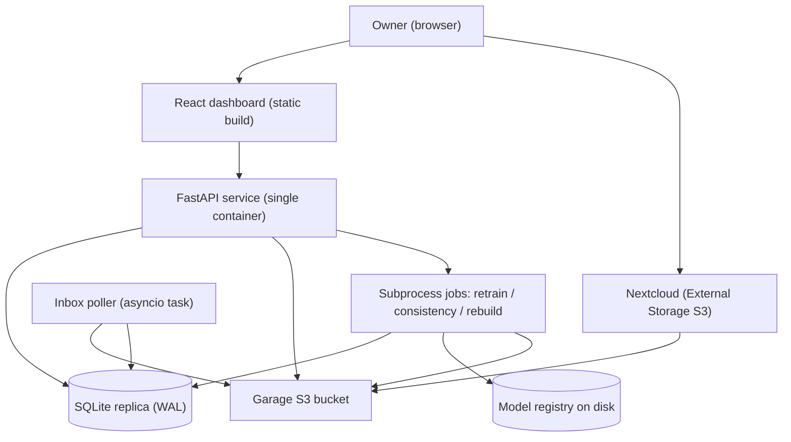
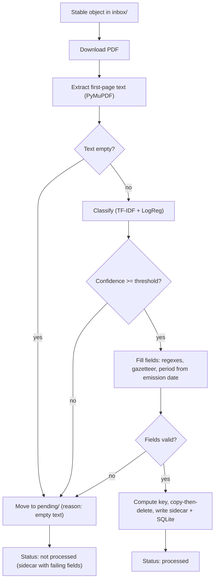
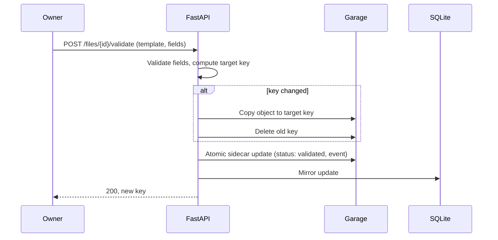

# Architecture — Automatic PDF Renamer

Architecture document derived from the PRD, following the BMAD method. Personal tool, single user, 100% offline, self-hosted.

## 1. Architecture Overview

A single Python service (FastAPI) hosts the API, the inbox poller, and the static React dashboard. It talks to a Garage S3 bucket (source of truth for objects and JSON sidecars) and mirrors metadata into a local SQLite replica.

Everything runs in one container, deployed next to the existing Garage and Nextcloud deployments. There is no message broker, no external database, and no runtime network access beyond Garage and local dashboard serving.

### 1.1 High-level view



## 2. Architecture Goals and Constraints

- Offline-first: no runtime downloads, no external services (NFR1, AC10).
- Zero silent wrong renames: every ambiguous path routes to not processed (NFR3).
- Crash safety: copy-then-delete renames, atomic sidecar writes, SQLite repairable from sidecars alone (NFR4, AC8, AC9).
- Minimal operational surface: one container, one YAML template config, env-var credentials (NFR6).
- Single user, local network: performance targets are modest (NFR2) but correctness targets are strict.

## 3. Tech Stack and Key Decisions

| Concern | Decision | Rationale |
|---|---|---|
| Language/runtime | Python 3.11+, single service | NFR7; ecosystem for ML and S3. |
| Web framework | FastAPI + Uvicorn | NFR7; async I/O for S3 polling and PDF streaming. |
| Text extraction | PyMuPDF | Fastest option; AGPL acceptable for a personal offline tool. Wrapped behind a small extractor interface so it remains swappable (PRD open question resolved). |
| S3 client | boto3 | Most complete API coverage (copy-object, versioning, ETag), mature Garage compatibility. Wrapped behind a thin storage interface; v1 ships one implementation. |
| SQLite access | SQLAlchemy ORM, WAL mode | Declared replica schema, typed models, migrations via Alembic. Sidecar remains authoritative; ORM layer only reads/writes the mirror. |
| ML classification | scikit-learn TF-IDF + Logistic Regression | PRD FR3.1; small corpus is sufficient, no deep learning needed. |
| Fuzzy matching | rapidfuzz | PRD FR4.2, counterparty gazetteer. |
| Dates | python-dateutil | PRD FR4.2, emission date parsing and period computation. |
| Frontend | React + Vite, react-pdf viewer | NFR7; built to static assets served by FastAPI. |
| Process model | API, poller, and background jobs in one container | Single-user tool; a process manager is unnecessary complexity. |
| Inbox poller | asyncio background task inside the FastAPI process | Lightweight, no queue infrastructure; restart scan (FR1.3) covers crash recovery. |
| Long jobs (retrain, consistency, rebuild) | Subprocesses launched and monitored by the API | Keeps the event loop responsive; status exposed via the existing endpoints (FR9, FR10). |
| Dashboard auth | Username + password (single account, env-var credentials, session cookie) | Local network but not fully trusted; cheap to implement. |
| Testing | Unit tests only, pytest | Single-user offline tool; the storage layer is behind interfaces so mocks are cheap. Integration/CI coverage deferred. |

## 4. Components

### 4.1 Service process (single container)

One Python process runs:

- FastAPI app: serves the API, the static dashboard, and the PDF streaming proxy.
- Poller task: asyncio loop, configurable interval, lists the `inbox/` prefix.
- Job supervisor: spawns subprocesses for retrain, consistency scan, and SQLite rebuild; tracks their status in memory and in SQLite.

On startup, the process runs the recovery scan (FR1.3, FR10.3): objects in `inbox/` and `pending/` without sidecar records are enqueued for processing.

### 4.2 Module layout

```
app/
  main.py            # FastAPI app, lifespan: recovery scan + poller start
  config.py          # env vars + YAML template loading
  storage/           # S3 interface (boto3), key helpers, collision suffix
  sidecar.py         # atomic sidecar write (temp key + copy), schema
  replica/           # SQLAlchemy models, sync, rebuild
  pipeline/          # extract (PyMuPDF), classify, fill fields, validate
  period.py          # period computation from emission date + template rules
  gazetteer.py       # counterparty matching (rapidfuzz)
  templates.py       # YAML template registry (slots, period rules, key patterns)
  rename.py          # copy-then-delete move + event logging
  jobs/              # poller, consistency scan, retrain subprocess, rebuild
  api/               # routes: files, templates, retrain, consistency, auth
web/                 # React + Vite app (built to static assets)
models/              # versioned model registry (initial + trained)
```

### 4.3 Processing pipeline

One ingestion run, fully synchronous within the poller task:



Every terminal step writes a sidecar event (classified, renamed, corrected, validated) per FR5.2. Sidecar first, SQLite second (FR5.1); the consistency job repairs any drift after a crash.

### 4.4 Storage layer

- boto3 client pinned to the Garage endpoint, credentials from env vars.
- Interface operations: list prefix, head object, get, put, copy, delete. Rename = copy + delete, collisions resolved with an incremental suffix before the copy.
- Sidecar write: put JSON to a temp key, then copy over the final sidecar key, then delete the temp key. Never an in-place overwrite.

### 4.5 Metadata and replica

- Sidecar JSON is the sole source of truth; schema per PRD section 7 (now including the period field).
- SQLAlchemy models `files` and `consistency_flags` mirror it. `extracted_text` is stored in SQLite for search; it is a replica, and the rebuild command repopulates it from sidecars.
- `POST /consistency/rebuild` and the CLI rebuild command both clear and repopulate SQLite from all sidecars (AC9).
- Divergence resolution is always sidecar-wins (PRD 3.2); the consistency job flags drift rather than guessing.

### 4.6 Period computation

A pure function of (emission date, template period rules): granularity in {day, month, quarter, year} and offset in {current, next}. Produces the human-readable period string (e.g. "Q3 2026", "September 2026", "2026"). Recomputed whenever the emission date or template changes on the detail page; the user can override the suggested value, and validation checks consistency between period, date, and template rules (FR4.2, FR4.3, AC5c).

### 4.7 Frontend

Single-page React app, built with Vite into static assets served by FastAPI. Views: file list (filters, counters, badges), detail page (embedded react-pdf viewer, five common fields, optional fields, template dropdown with candidate scores, live key preview), templates list, retrain and consistency pages. Auth: login form, session cookie, all API routes behind the auth dependency except the PDF stream which shares it.

## 5. Data Flow: Renaming and Validation



## 6. Jobs and Scheduling

| Job | Trigger | Execution |
|---|---|---|
| Inbox poll | Interval (configurable, default from PRD) | asyncio task, in-process |
| Stability check | Two consecutive listings, same size + ETag | Poller state kept in memory |
| Consistency scan | Periodic (configurable) + on demand | Subprocess |
| Retrain | Dashboard action | Subprocess; writes a new versioned model dir; activation is an atomic pointer swap, no restart (AC6) |
| SQLite rebuild | Dashboard action or CLI | Subprocess |

Subprocesses report progress and metrics by writing a status JSON consumed by the API's status endpoints. Only one job of each kind runs at a time; the API refuses a duplicate start.

## 7. Configuration and Secrets

- Templates: single YAML file (or a directory of YAML files) defining, per template: document family, document types, period rules, optional field schema, extraction regexes, validation rules, key pattern, target prefix.
- Environment: S3 endpoint, access key, secret key, bucket name, poll interval, confidence threshold, dashboard credentials, paths (SQLite file, model registry, template YAML).
- No secrets in the YAML; no secrets in sidecars.

## 8. Error Handling and Crash Safety

- Ingestion: any unexpected exception marks the file not processed with the reason in the sidecar; the poller continues.
- Rename: copy strictly before delete; a crash between the two leaves both keys, and the startup scan re-evaluates (the sidecar's current key is authoritative).
- Sidecar/SQLite: sidecar first; drift repaired by the consistency job; rebuild is always possible from sidecars alone.
- Retrain: trained models land in a new versioned directory; activation swaps an active-model pointer; a failed training run leaves the current model untouched.
- All object-not-found conditions during processing are treated as consistency anomalies and flagged (FR5.3).

## 9. Deployment

- One Docker image: Python backend + prebuilt static frontend assets + model registry. Garage and Nextcloud are pre-existing deployments on the same network; the compose file of this project only declares the renamer service.
- SQLite file and model registry on a mounted volume; container restarts are stateless otherwise.
- Offline dependency policy: all Python wheels and the frontend build are baked into the image build; the spaCy French model, if used, is vendored at build time.

## 10. Testing Strategy

- Unit tests only (pytest), per the stack decision.
- Mocked seams: storage interface (fake in-memory S3), extractor interface, classifier (fixture model), clock.
- Priority coverage: period computation (granularity/offset matrix), field validation, collision suffix logic, sidecar atomicity ordering, rebuild determinism, key pattern rendering.
- The pipeline is exercised end-to-end in unit tests with mocked S3 to validate the not-processed routing reasons.

## 11. Architectural Risks and Mitigations

| Risk | Mitigation |
|---|---|
| PyMuPDF AGPL incompatibility if the tool is ever shared | Extractor interface keeps the swap to pdfplumber cheap. |
| Garage quirks in copy-object/versioning | Week 1 spike per PRD; storage interface isolates the client. |
| Corpus too small for reliable classification | Low-confidence routing to pending; retrain on validated files grows the corpus. |
| SQLite drift after crash | Sidecar-first ordering + consistency job + full rebuild path. |
| Single-process blast radius | Long jobs are subprocesses; the poller catches per-file exceptions. |

## 12. Traceability to PRD

Every epic maps to a component: ingestion (jobs/poller), extraction and classification (pipeline), data model and validation (templates, period, gazetteer, pipeline), renaming and logging (rename, sidecar), dashboards (web + api), template management (templates.py + config), retraining (jobs/retrain + models), consistency and recovery (jobs/consistency, replica/rebuild). Acceptance criteria AC1-AC12 are covered by the components above; AC8-AC10 by section 8, AC9 by section 4.5.